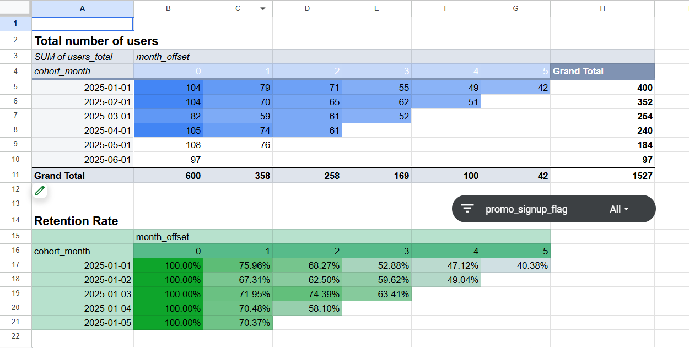

# Cohort-Analysis-SQL-GoogleSheets
User Retention analysis using SQL for data extraction and Google Sheets for visualization
# User Retention: Cohort Analysis (SQL & Google Sheets)

## 📌 Project Overview
This project focuses on calculating and visualizing **User Retention Rate** using a cohort-based approach. The goal was to analyze how different groups of users (cohorts) return to the platform over a 6-month period and identify key churn points to support business decision-making.

## 🛠️ Tech Stack
* **SQL (PostgreSQL):** Advanced data cleaning using Regex, date standardization, and complex cohort logic with month offset calculations.
* **Google Sheets:** Data processing via Pivot Tables and creation of a dynamic **Retention Matrix (Heatmap)**.

## 📂 Project Structure
* `cohort_retention_analysis.sql`: Full SQL script featuring CTEs for data transformation and aggregation.
* `cohort_data_sample.csv`: The processed dataset extracted from the database.
* `user_retention_analysis_matrix.png`: Visual representation of the retention matrix.

## 🔍 Key Insights from the Analysis
By analyzing the cohorts from January to June 2025, I discovered:
* **The January Cohort** demonstrated the highest long-term loyalty, maintaining a **40.38% retention rate** by the 5th month.
* **Onboarding Gap:** There is a significant drop in users between Month 0 and Month 1 across all cohorts, suggesting an opportunity to improve the initial user experience.
* **Campaign Impact:** Users who signed up without a promo code generally showed more stable retention than those from promo-driven campaigns.

## 📊 Final Visualization (Heatmap)
Below is the retention matrix generated in Google Sheets:

---
*Developed by Kryvoruchko as part of the Data Analytics Portfolio.*
